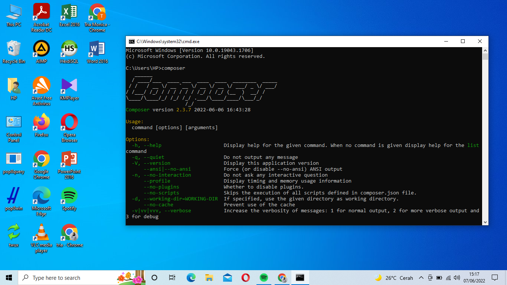
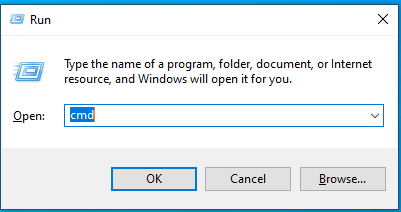
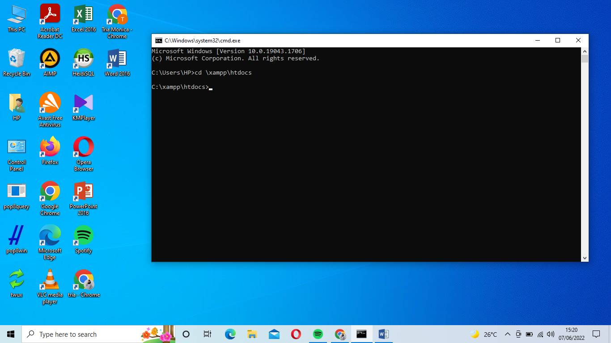
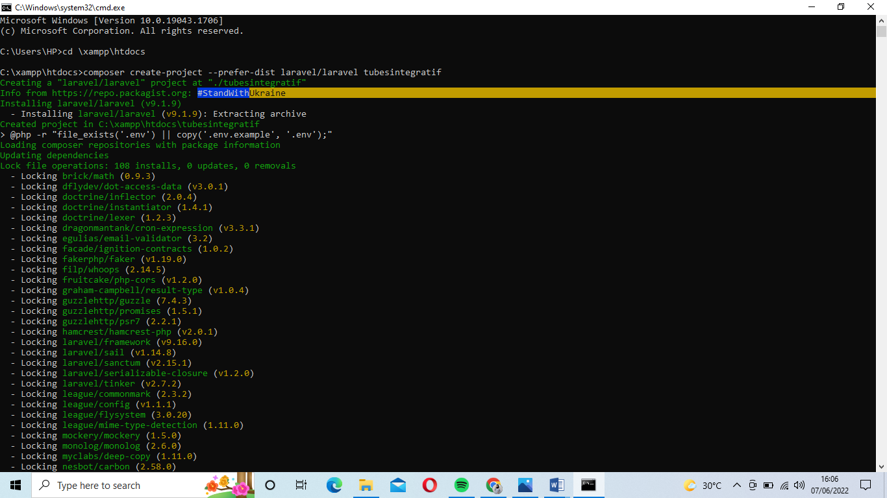
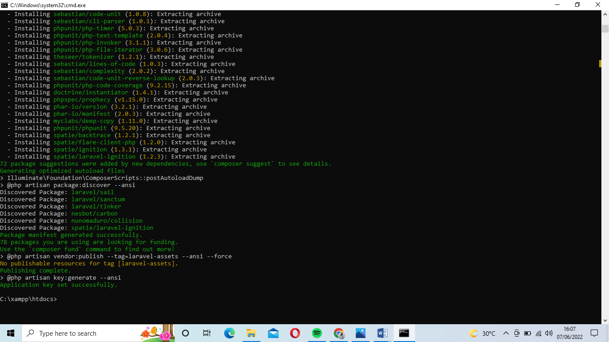
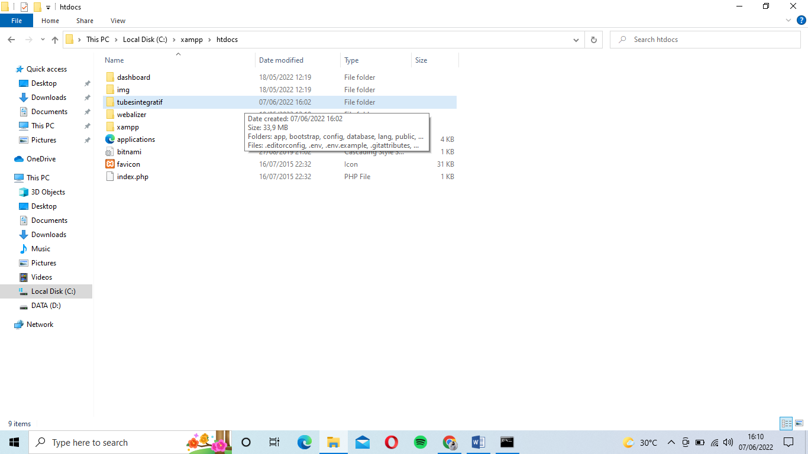
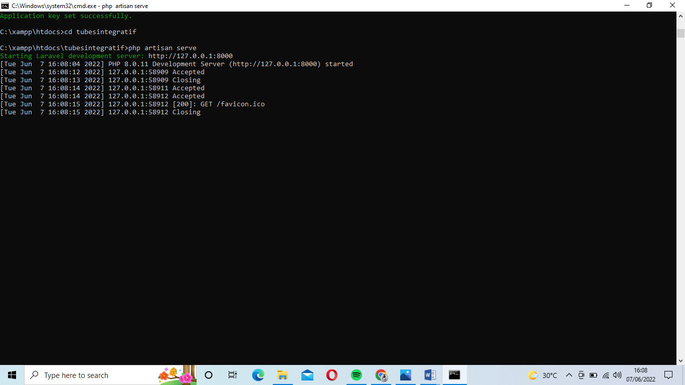
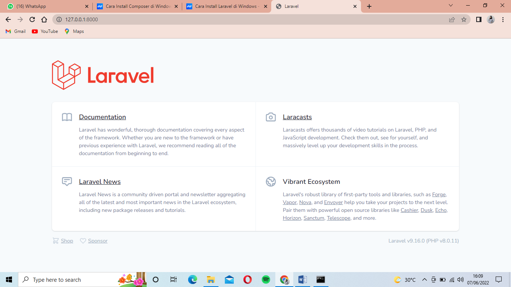

# 				FINAL PROJECT LARAVEL 

**Tahap 1 Install Laravel** 

1. Sebelum install Laravel, hal pertama yang harus dilakukan adalah install Composer

   

   

2. Setelah dilakukan install Composer, maka langkah selanjutnya yaitu masuk Command Prompt dengan cara klik Win+R lalu ketik cmd dan klik **OK**

   

   

3. Sebelum melakukan instalasi Laravel, arahkan Command Prompt atau terminal menuju direktori file server. Lokasi file server pada XAMPP secara default berada pada direktori xampp/htdocs. Masukan perintah ini pada jendela Command Prompt untuk masuk ke direktori htdocs.

   ```markdown
   cd \xampp\htdocs
   ```

   

   

   

4. Setelah itu, membuat request untuk mengambil (serta menginstall) file Laravel yang telah disediakan dalam repositori Github. 

   ```
   composer create-project --prefer-dist laravel/laravel nama_projectmu
   ```

   

   

   

   

   

5. Setelah proses download file Laravel selesai, nantinya akan ada folder baru pada direktori file server dengan nama sesuai nama project yang telah dibuat. 

   

   

6. Untuk memastikan bahwa Laravel sukses terinstall dan siap untuk digunakan, arahkan Command Prompt atau Terminal menuju direktori yang telah dibuat sebelumnya.

   ```markdown
   Php artisan serve
   ```

   

   

   

7. Apabila sudah muncul tulisan ``Laravel development server started`` pada Command Prompt atau Terminal, maka langkah selanjutnya yaitu membuka link yang telah disediakan oleh Laravel.  Secara default, akan diarahkan menuju alamat server, yaitu 127.0.0.1:8000. Nantinya, akan muncul tampilan homepage dengan tulisan Laravel di bagian tengah seperti pada gambar di bawah ini

   

   

